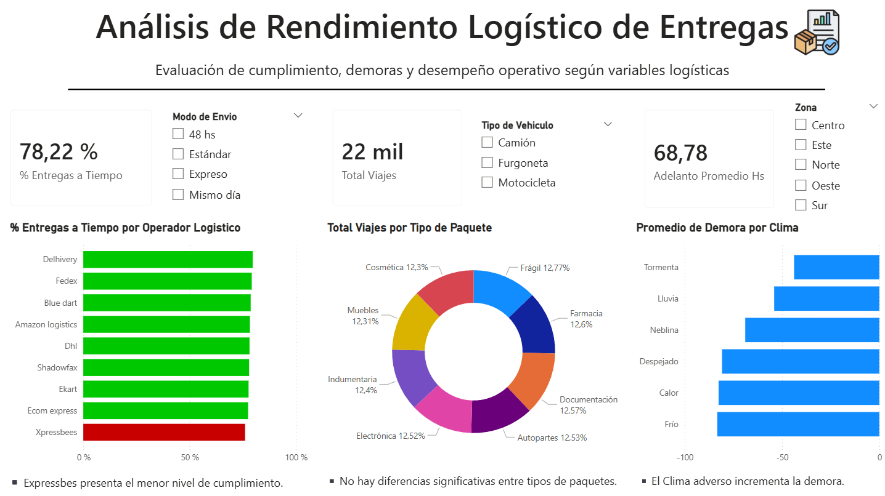
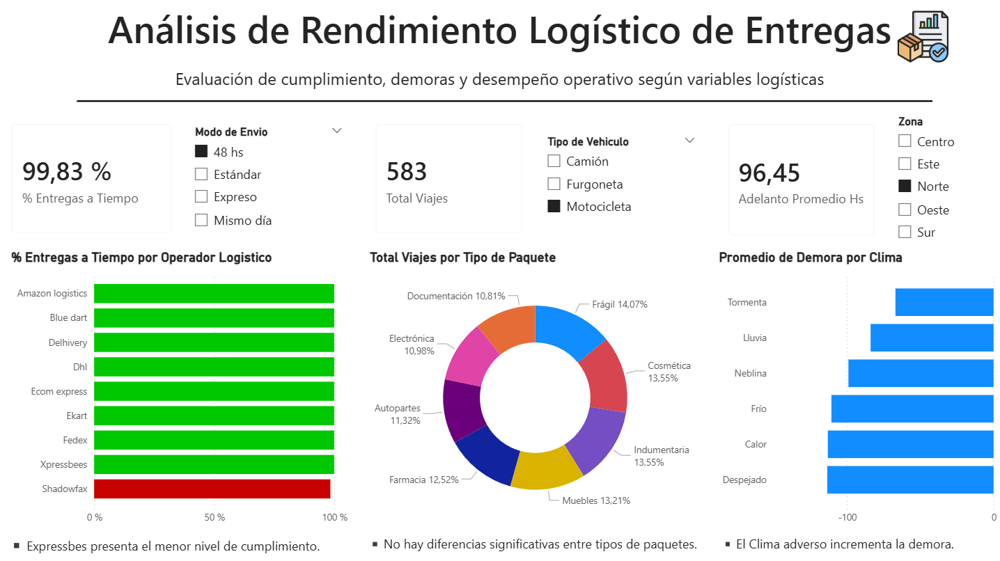

# 📊 Análisis de Rendimiento Logístico de Entregas

## 🎯 Objetivo
Analizar el desempeño de entregas logísticas para identificar demoras, evaluar cumplimiento y detectar oportunidades de mejora en la operación.

---

## 🛠️ Herramientas utilizadas
- Python (Pandas)
- Power BI
- Excel

---

## 📂 Dataset
- Dataset original: Delivery_Logistics.csv
- Dataset procesado: Logistics_Final_Project.csv

---

## 🔧 Proceso
1. Limpieza y transformación de datos
2. Normalización de variables
3. Creación de KPIs
4. Análisis exploratorio
5. Desarrollo de dashboard interactivo en Power BI

---

## 📊 Dashboard

El dashboard permite analizar el rendimiento logístico mediante filtros interactivos como:

- Zona
- Tipo de envío
- Tipo de vehículo
- Condiciones climáticas

---

## 📈 KPIs principales
- % entregas a tiempo
- Total de envíos
- Adelanto promedio (hs)

---

## 🔍 Insights clave
- Xpressbees presenta el menor nivel de cumplimiento
- No hay diferencias significativas entre tipos de paquetes
- El clima adverso incrementa la demora

---

## 🚀 Conclusión
El análisis permitió identificar factores que afectan el rendimiento logístico, como el impacto del clima y el desempeño de operadores, facilitando la toma de decisiones para optimizar la operación.
